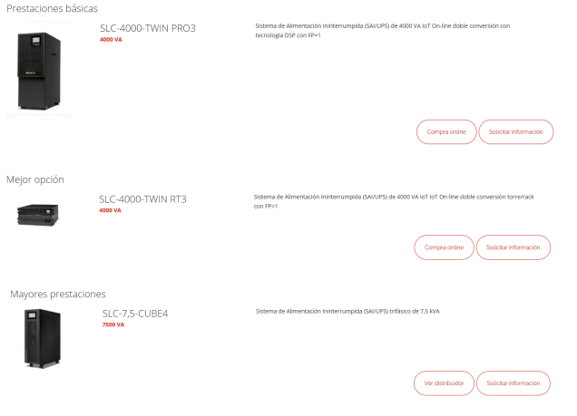

# Solució: T02: Selecció d’un SAI per una empresa client

👤 Autor: Jhon Justiniano
🏫 Curs: SMX-B
🔒 Mòdul: Seguretat Informàtica

## 🗂️ Índex

Descripció del cas

Inventari d’equips

Càlcul de potència total

Determinació de l’autonomia

Recerca de models de SAI

Solució

## 📄 1. Descripció del cas

L’empresa TecnoGestió S.L., dedicada a la gestió documental i assessorament informàtic, té un petit despatx amb:

💻 4 ordinadors de sobretaula

🖨️ Una impressora-fotocopiadora multifunció (similar a les de l’escola)

🌐 Un router d’accés a Internet

⚡ Davant les constants incidències amb el subministrament elèctric a la zona, la direcció ha decidit adquirir un SAI (Sistema d’Alimentació Ininterrompuda) per garantir la continuïtat del servei i protegir els equips.

S’han posat en contacte amb l’empresa on esteu fent l’estada, i el vostre responsable us ha encarregat que feu l’estudi i la tria del SAI.

## 🧾 2. Inventari d’equips

📋 Llista dels dispositius que es connectaran al SAI (ordinadors, monitors,
router, etc.), justifiqueu si hi ha algun aparell que no hi connectareu al
sistema d’alimentació ininterrompuda.

🖥️ 4 ordinadors de sobretaula

🖨️ 1 impressora-fotocopiadora multifunció (no es connectarà al SAI)

🌐 1 router d’accés a Internet

🔍 Consulta de les especificacions tècniques per obtenir el consum de
cada dispositiu. Seleccioneu components que s’ajustin als que podríeu
trobar-vos a la seu del client. Indiqueu clarament les dades del
component triat i els valors de watts i VA corresponents.

🖥️ 4 ordinadors de sobretaula x 600 watts cada un = 2400 watts

🖨️ 1 impresora no la conectaremos

🌐 1 router d’accés a Internet = 20 watts

## ⚡ 3. Càlcul de potència total

Valor total de potència i valor incloent la reserva del 20%.

Potència eficaç : 2420 watts

Potència aparent: (2420/0,7)= 3457,143 VA

Tenint en compte el marge de seguretat (20%) necessitem un:

✅ SAI de (3457,143/0,8) = 4321.428 VA

## ⏱️ 4. Determinació de l’autonomia

El SAI ha de permetre mantenir els equips en funcionament durant almenys 10 minuts, per tal de guardar els treballs i apagar correctament els sistemes.

## 🔍 5. Recerca de models de SAI

S’han buscat 2 o 3 models que compleixin els requisits següents:

Potència ≥ 4.000 VA

Autonomia mínima de 10 minuts

Tipus de sortides adequades

Preu i marca competitius

## 💡 6. Solució proposada

La millor opció és el SAI SLC-4000-TWIN RT3, ja que ens ofereix potència suficient i també
amb marge, té tecnologia en línia de doble conversió, compte amb més versatilitat en poder
instal·lar-se en torre o en rack i també té funcions de monitoratge. Per això és la millor i més
equilibrada en qualitat, prestacions i preu.
