# Solució: T03: Seguretat Lògica: recuperant accés a sistemes

👤 Autor: Jhon Justiniano
🏫 Curs: SMX-B
🔒 Mòdul: Seguretat Informàtica

## 🗂️ Índex

- Introducció

- Procediment individual

- Vulnereu l’accés al GRUB del Linux

- Identifiqueu l’usuari del sistema

- Modifiqueu la contrasenya de l’usuari i verifiqueu que ara ja té accés

- Investigueu com es pot fortificar l’accés al GRUB. És molt important que indiquis les fonts d’informació que usis

- Configura la màquina virtual per tal de fortificar l’accés al GRUB

## 📄 Introducció
Després de la primera feina exitosa, us arriba un encàrrec urgent que obliga a que us hi poseu per donar-li solució.

Com a fase prèvia rebreu una formació sobre la seguretat lògica que us permetrà tenir els coneixements necessaris per afrontar la tasca.

Han arribat a la consultora un equip provinent d’un client que demana que els hi solucionem el problema.

Tenen un portàtil amb Zorin OS (un Linux amb entorn gràfic) que usava habitualment un directiu. El problema és que ha oblidat la contrasenya i és necessari poder recuperar l’accés perquè hi ha documentació molt important que cal recuperar. Per evitar que una acció catastròfica pugui danyar l’equip original, ens han clonat el disc en un disc virtual perquè hi treballeu.

Per tant, el primer pas serà crear una màquina virtual al que connectareu aquest disc. A continuació, cal que entreu a la màquina virtual, trobeu el nom de l’usuari existent i assigneu-li una contrasenya nova.

Quan el client és informat del senzill que és accedir a l’equip, demana si n’hi ha alguna manera de fortificar el sistema, ja que té por que si algú roba el portàtil hi pugui accedir a la informació que hi conté. Per tant, ara ens demanen que cerquem solucions per tal d’evitar que es pugui reiniciar la contrasenya amb el procediment anterior.

Investigueu el procediment per tal que l’accés al GRUB quedi protegit per contrasenya per evitar canvis de configuració.

## 💻 Procediment individual
Primer abans de tot hem de crear la màquina, per això ens anem a virtualbox i li donem a nova, posem al nom, on la volem guardar i per últim posar l’ISO que ens van donar en la comuna.

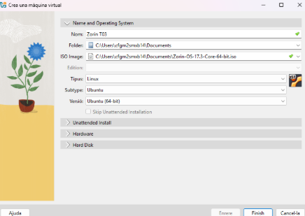

Desprès ens anem a hardware y posem de memòria base 4096 MB i de processadors hi posem 4.

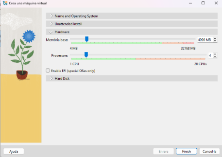

Seguidament ens dirigim a configuracions i a l’apartat de emmagatzematge hem de posar el discs que tambè ens la donan en la comuna, el disc ho hem de posar com a sata. Desprès guardem i li donem a iniciar la màquina.

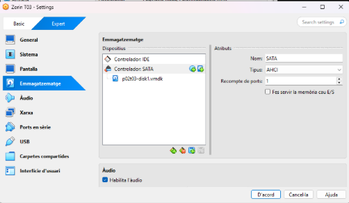

## 🔒 Vulnereu l’accés al GRUB del Linux
Una vegada li donem a iniciar la máquina hem de presionar shift + qualsevol lletra, això ho hem de fer per poder estar com a root sense que iniciem sessió. Ens surtirà un menú el cual en d’entrar a “Advanced options for Zorin”

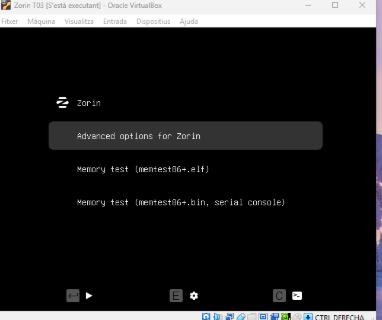 

Una vegada entrem ens sortirà un altre menù el cual hen d’entrar a la segona opció “Zorin, with Linux 6.8.0-85-generic (recovery mode)”

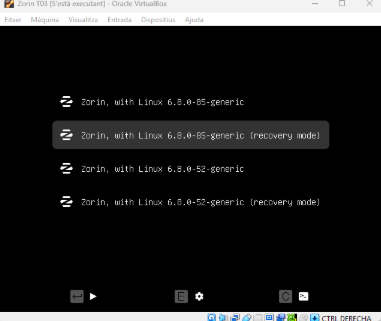

Ens sortirà un altre cop un altre menù i hem de posar l’opció root per poder posar-nos com a root.

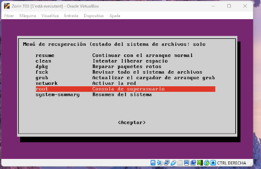

Un altre cop en sortirà el mateix menù com abans i un altre cop posem root per poder posar-nos com a root. Abaix en la pantalla ens sortirà que hem de donar enter, li donen a enter y a contrel D per poder continuar.

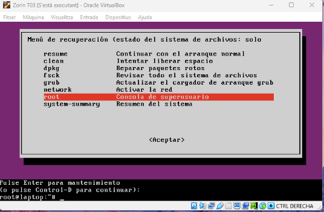

## 👤 Identifiqueu l’usuari del sistema
Per identificar l’usuari com ja estem como a root hen de fer les següents comandes: mount -rw -o remount /

El següen comanda ens mostra l’usuari: cat /etc/pa

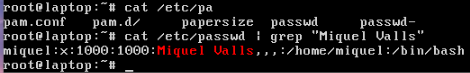

## 🧑‍💻 Modifiqueu la contrasenya de l’usuari i verifiqueu que ara ja té accés
Com ja hem identicat l’usuari per modificar la contrasenya d’usuari hem de fer el següent comando: passwd miquel i podem la nova contrasenya, en aquest cas li vaig posar usuari.

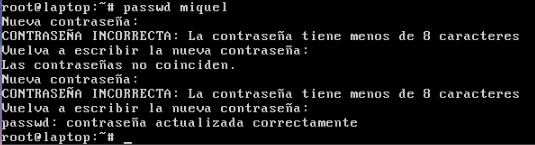

Una vegada en canviat la contrasenya entrem a la màquina y y posem la contrasenya i verifiquen que hi tenim accés.

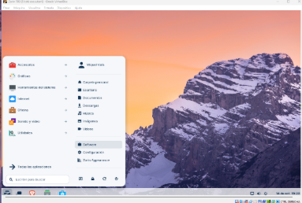

## 🔎 Investigueu com es pot fortificar l’accés al GRUB. És molt important que indiquis les fonts d’informació que usis
Personalment vaig entrar a la pàgina d’Ubuntu, vaig buscar per google com fortificar l’accès al GRUB i en va sortir la pàgina d’Ubuntu.
https://manpages.ubuntu.com/manpages/focal/en/man1/grub-mkpasswd-pbkdf2.1.html
En la pàgina ens diu que podem fortificar l'accés fent el següent comando: grub-mkpasswd-pbkdf2

## 🔐 Configura la màquina virtual per tal de fortificar l’accés al GRUB
Per fortificar l’accès com ja hem vist abans fer la següent comanda en la terminal de la màquina virtual. grub-mkpasswd-pbkdf2

Copiem des de grup cap en davant. Fins al final.

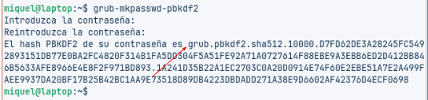

Seguidament podem aquesta comanda per poder entrar i editar l'arxiu:

Una vegada dins de l’arxiu guardem fen control R y poden la comanda: salida.txt

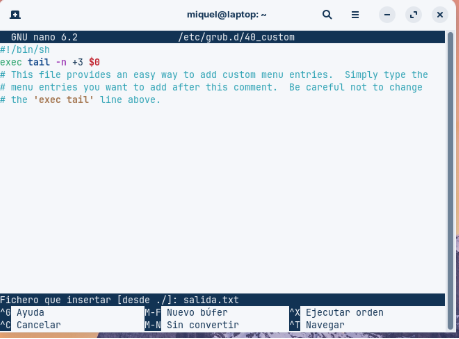

Desprès de guardar poseen la comanda : set superusers= y nuestro nombre entre comillas: set superusers= “Jhon” just vaig d’això posen: password_pbkdf2 Jhon i peguem ho que abans hem copiat, que sería l'autenticació.

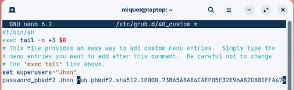

Per últim posem aquesta comanda i comprovem i ja estem.

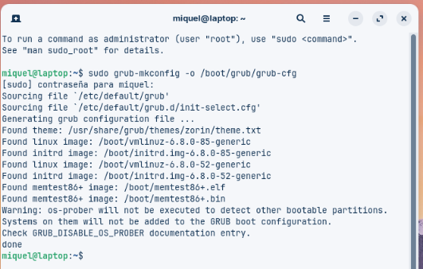

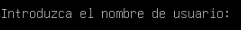

[Torna a l'enunciat](README.md)
